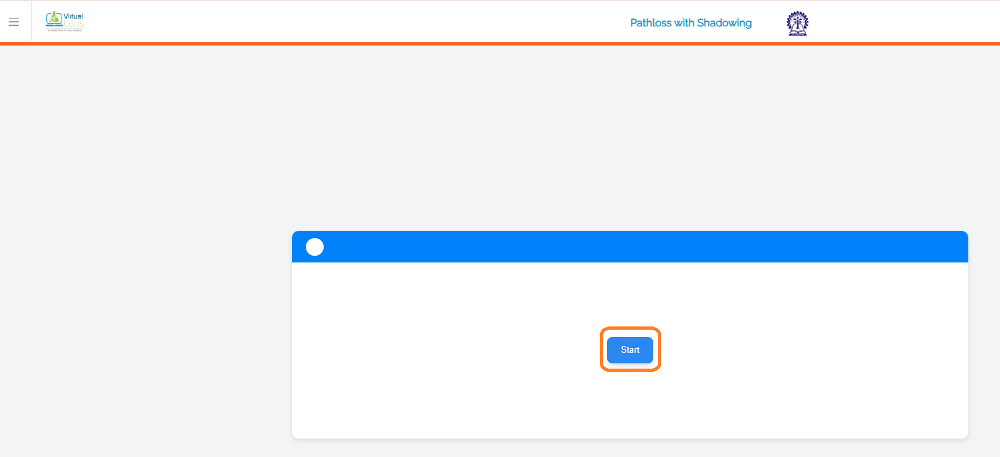
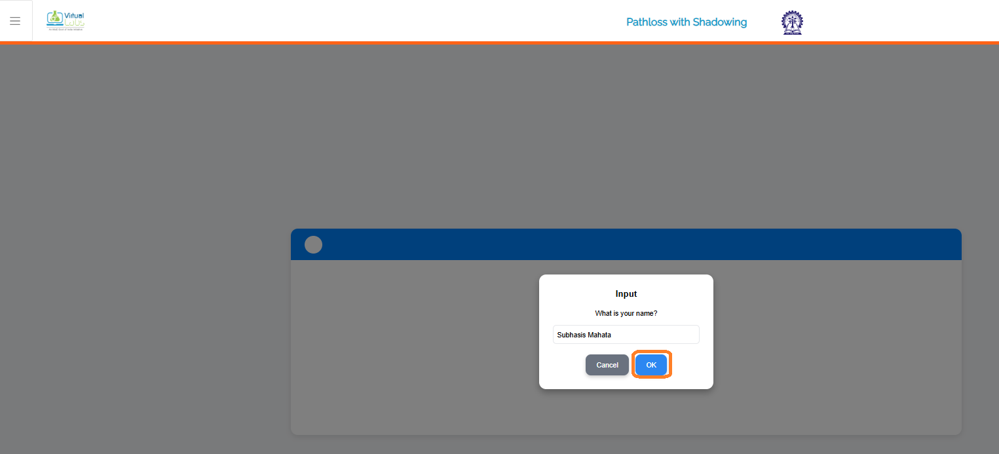
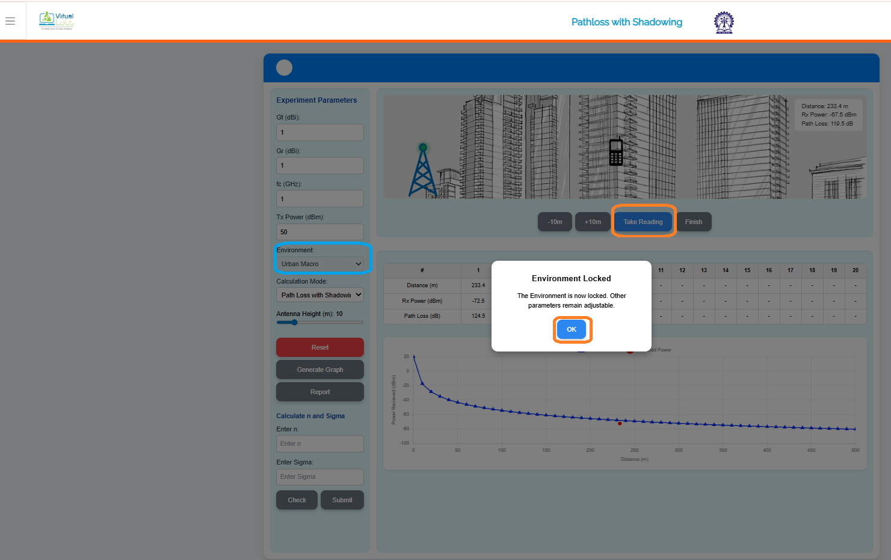
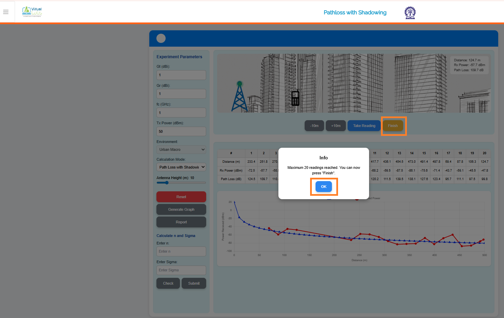
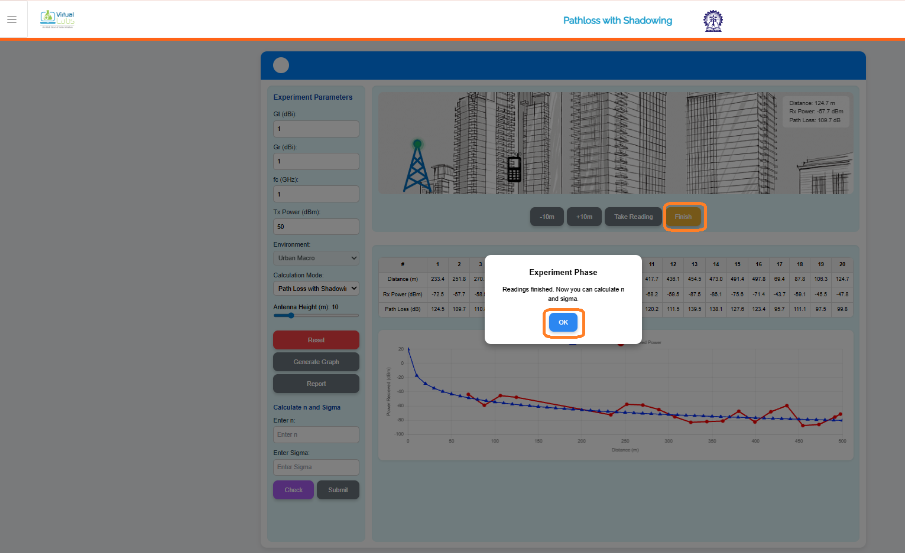
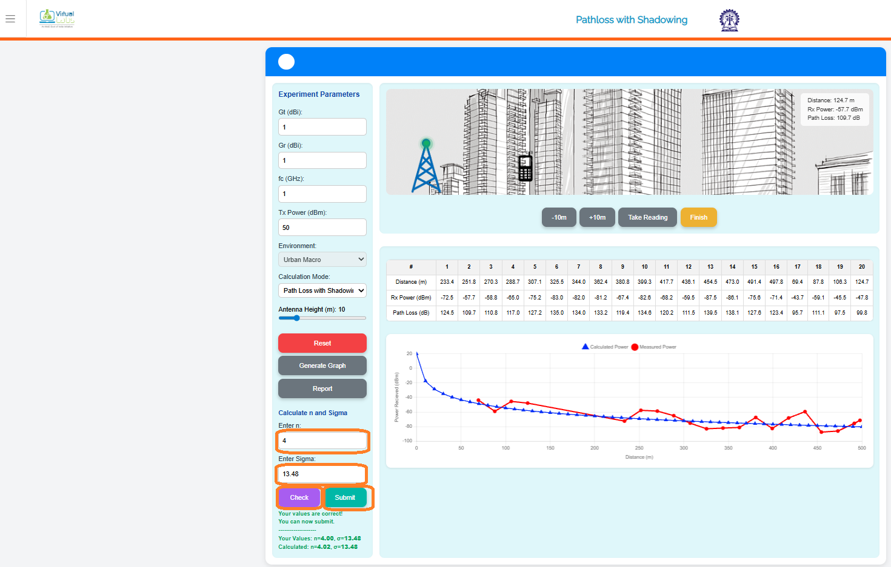
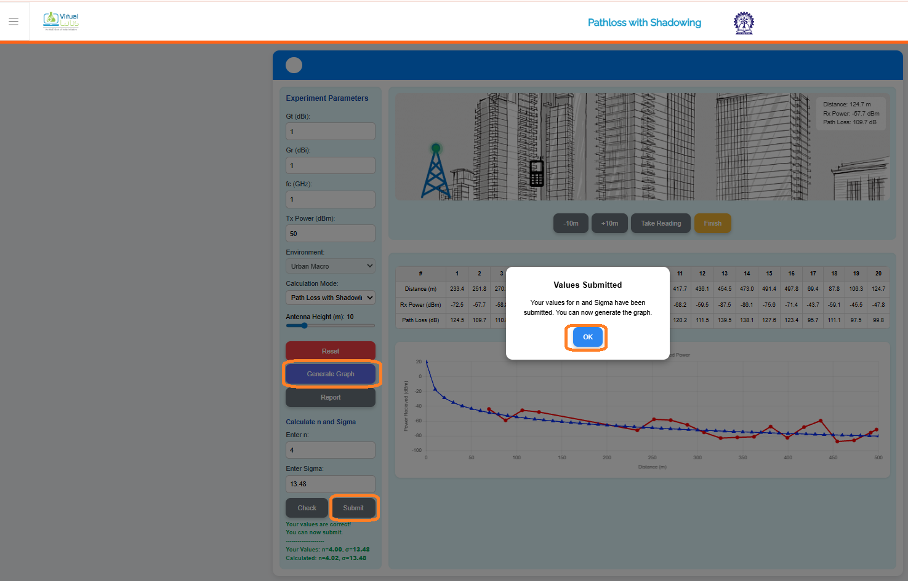
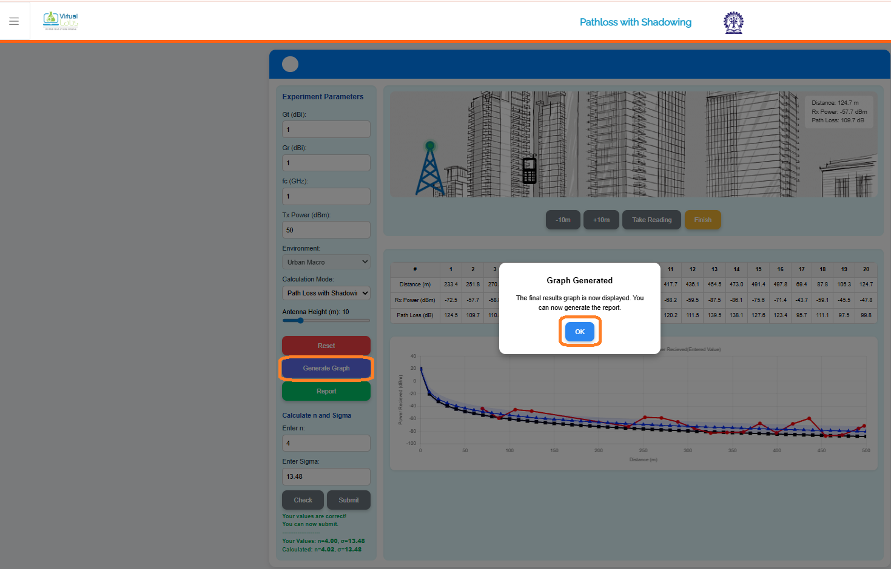
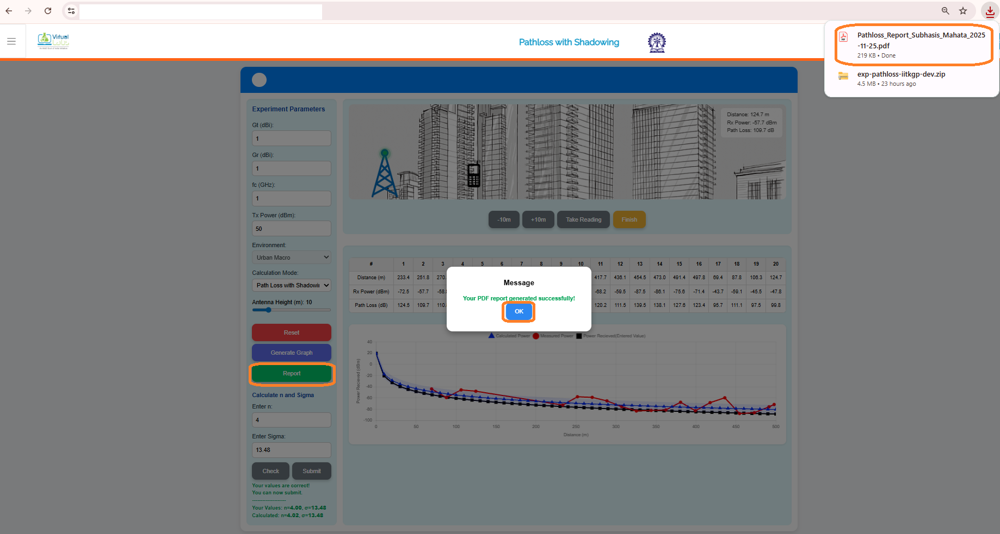
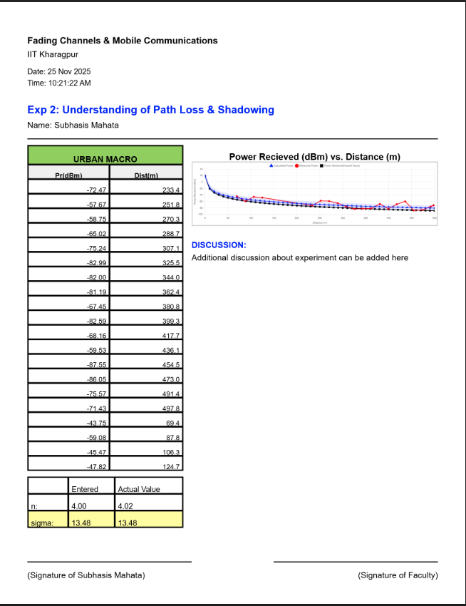

## Procedure

Follow the instructions given below to perform the experiments:-

### 1.1 Starting Experiment 2 :-

Step 1:-Click on the start button. A page appears with a dialogue box asking for your name. Enter your name and click OK.

      
      

      
      

      
### 1.2 Performing the Experiment :-

- Step 2:-Enter the values of Gt ,Gr, fc,Tx power in the box provided on the page. Adjust the slider for fixing the antenna height. Set the Enviornment These are all initial parametes of the experiment.

- Step 3:-Drag the mobile by placing the cursor on it and place it at a certain distance from the base station tower. Click on the button TAKE READING and record the values of received power at that position of the mobile and distance of the mobile from the base station, click on the buttons +10m and -10m to change the position of the mobile or change the position using drag of mouse courser and record the values of received power in dBm and distance. Click on the button FINISH once you finish taking 20 readings.
  

      
      

      
      

      
- Step 4:-Now calculate the value of n and sigma manually by following the example given in the theory section and enter your calculated value of n and sigma in the box provided.

- Step 5:-Click on the button CHECK to verify whether your manually calculated value matches the computed value.

      
      

      
      

      
- Step 6:-After,clicking on button CHECK button, If your calculated value matches with the computed value then a message appears stating that your entered values are correct. If your values are not correct then the exact values of the unknown parameters are displayed just next to the boxes where you have entered your calculated values of n and sigma.

- Step 7:-After,clicking on SUBMIT button  you have to click GENERATE GRAPH to view a plot of received power(dBm) vs distance(m).

      
      

      
      

      
- Step 8:- If you want to perform the entire experiment once again click on the button RESET.

### 1.3 Generating and saving the Report :-

- Step 9:-Click on the button REPORT to generate report.

      
      

      
- Step 10:-Finally, a message will appear that YOUR REPORT GENERATED SUCCESSFULLY. After view-ing the message click on the OK button.

- Step 11:-You can view the pdf report of the experiment you have done.
  

      
      

    
