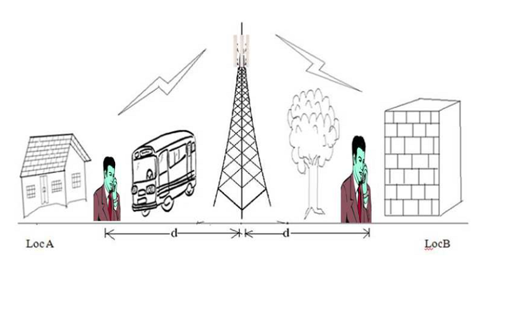
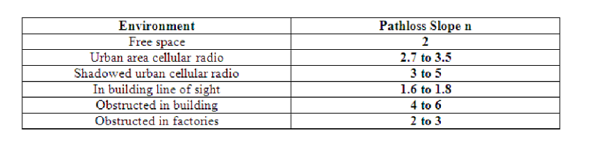

## Theory

The large scale signal power strength prediction model is useful in predicting the average signal strength as a funtion of separation distance the Tx and Rx.This may include antenna gains, height, frequency of operation etc. The pathloss model does not discriminate between two locations which are at the same distance from the B.S., but are at two distinct directions. This is because the P.L. model does not take into account the local clutter. It rather gives the area mean. However in reality if we consider two locations in two different directions as is given in g, locA and locB which are at the same distance 'd' from the B.S. but have di erent local clutter, then it will be found that the local means at location A and B are not same. The P.L. model only gives an average value in an area.If several such local mean signal strength are taken an average is taken and then this result will match with that predicted by the P.L. formula provided appropriate value of $n_p$ is used. Thus in other words if say local mean signal strength is $P_r(d_i)$ at location 'i' then

$$\frac{1}{N} \sum_{i=1}^{N} P_r(d_i) = \bar{P_r(d)}$$

      
      

Where $\bar{P_r(d)}$ is predicted using the appropriate( value of $n_p$) path loss model.

In fact $n_p$ is determined using curve fitting. Since the local mean is a random value the effect is captured through the shadowing process. Hence the earlier P.L. formula is extended to take into consideration the local mean variation.

Thus the received signal strength at a distance d taking in consideration the shadow e effect is :

$$PL(d) = \bar{PL(d_0)} + 10n_p\log_{10}(d/d_0) + X_{\sigma}$$

Where,

$X_{\sigma}$ is a random variable.

The random variable $X_{\sigma}$ is modeled as log normal with zero mean and variable $\sigma_x$. This is as observed in several measurements values of $\sigma_x$ lies between 4 and 12 dB. In macro cells is typically 3dB. In microcells it is typically 6-8 dB.

The log normal process is used in simulations, as well as in analytical evaluations.

### 1.1 Example for calculating n and $\sigma$ :-

The received power at a distance d from the transmitter can be calculated using the following formula

$$P_r(d) = P_r(d_0) - 10n\log(d/d_0)$$

The MMSE estimate for the path loss exponent n can be found by using the formula below:-

$$J(n) = \sum_{i=1}^{k}(P_r - \hat{P_r})^2$$

Where,

$P_r$ is the computed value.

$\hat{P_r}$ is the calculated value.

Follow the example below to calculate n and $\sigma$
Suppose you have the following set of values:-

      
      

Assume received power at close-in-reference distance from transmitter = 0dBm. Assume close-in-reference distance=100m.

Now calculate received power at 4 locations of the mobile

$$P_r(d1) = 0 - 10n\log(200/100) = -3n$$

$$P_r(d2) = 0 - 10n\log(600/100) = -8n$$

$$P_r(d3) = 0 - 10n\log(800/100) = -9n$$

$$P_r(d4) = 0 - 10n\log(1000/100) = -10n$$

J (n) is the sum of squared errors between measured and estimated values.

Now, $J(n) = (-10 - (-3n))^2 + (-30 - (-8n))^2 + (-41 - (-9n))^2 + (-60 - (-10n))^2 = 6281 - 2478n + 254n^2$
Value of n which minimizes mean square error can be obtained by equating derivative of J (n) to 0. Now, equating the derivative of J (n) to 0.

$$\frac{dJ(n)}{dn} = 0 \Rightarrow 508n - 2478 = 0 \Rightarrow n = 4.87$$

Now calculate sigma in the following way:-

$$\sigma^2 = \frac{J(n)}{4}$$

So, J(n) at n =4.87 can be obtained as:

$$J(n) = (-10+14.61)^2 + (-30+38.96)^2 + (-41+43.83)^2 + (-60+48.7)^2$$

$$= 21.25 + 17.92 + 8 + 127.69 = 174.86$$

$$\sigma^2 = \frac{J(n)}{4} = \frac{174.86}{4} = 43.71$$

$$\sigma = \sqrt{43.71} = 6.61 \text{ dB}$$

     
 
